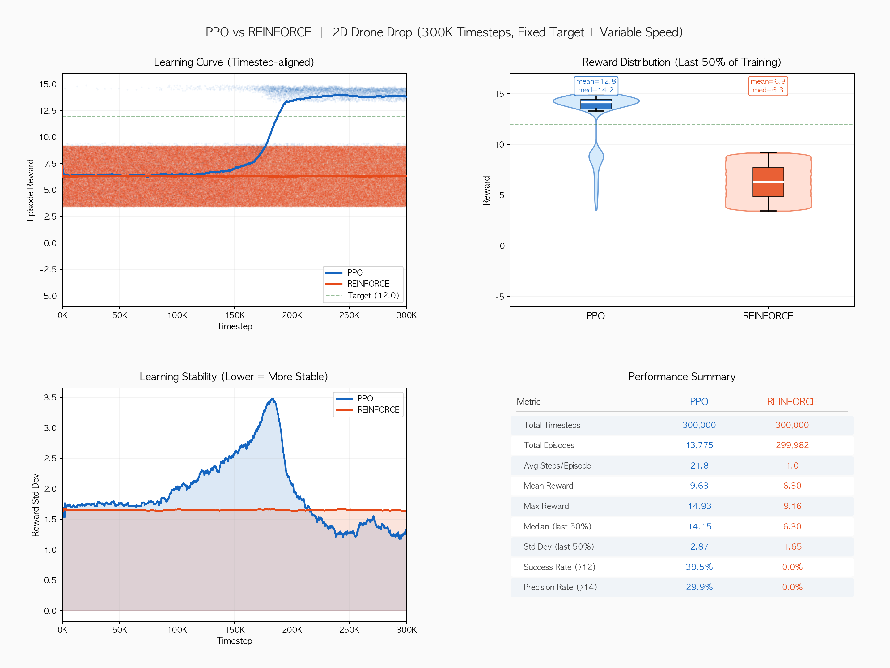
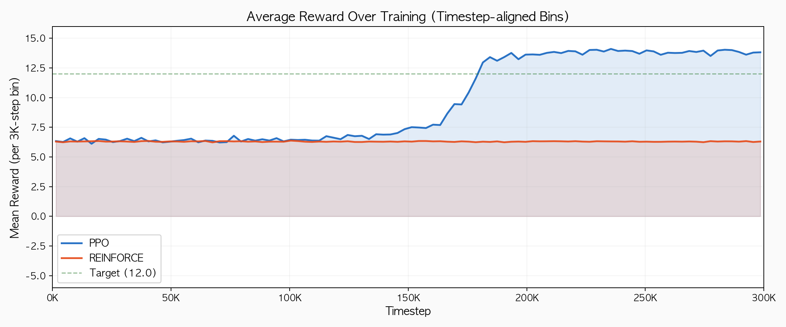

# 2D Drone Drop — 강화학습 투하 타이밍 최적화

드론이 고정 고도에서 수평 비행하며, 다양한 속도 조건에서 패키지를 투하하여
지상 목표 지점에 최대한 정확히 착지시키는 강화학습 프로젝트.

> CartPole PPO 예제의 후속 프로젝트로, **커스텀 Gymnasium 환경 설계**와
> **PPO vs REINFORCE 알고리즘 비교**에 초점을 맞추었다.

---

## 환경 개요

```
     드론 (고도 500px, 속도 60~160 px/s)
     ─────►  ●═══╗
                  ║  투하!
                  ║
                  ▼ 포물선 낙하 (t_fall ≈ 2.26s)
    ─────────────╳────────────── 지면
                목표 (x=400, 고정)
```

| 항목 | 값 |
|------|-----|
| 환경 타입 | Gymnasium 커스텀 (`DroneDropEnv`) |
| 관측 공간 | 4차원 연속 (위치, 속도, 상대거리, 타이밍 신호) |
| 행동 공간 | 이산 2개 (WAIT=0, DROP=1) |
| 물리 | 포물선 운동, 공기저항 없음 |
| 렌더링 | Pygame (human / rgb_array) |

### 핵심 물리

```
낙하 시간:  t_fall = sqrt(2 × 500 / 196.2) ≈ 2.258s (고정)
수평 이동:  drift  = speed × t_fall
최적 투하:  drone_x = target_x - drift
```

에이전트는 **매 에피소드 달라지는 속도**에 맞춰 최적 투하 타이밍을 일반화 학습해야 한다.

### 관측 벡터 (obs_dim = 4)

| idx | 의미 | 범위 |
|-----|------|------|
| 0 | `drone_x / WORLD_WIDTH` | [0, ~1.5] |
| 1 | `drone_speed / MAX_SPEED` | [0.375, 1.0] |
| 2 | `(drone_x - target_x) / WORLD_WIDTH` | [-1.0, 1.5] |
| 3 | `(drift - remaining) / WORLD_WIDTH` | [-1.5, 1.5] |

`obs[3]`은 **투하 타이밍 신호**로, 0에 가까울수록 지금이 최적 투하 시점이다.

### 보상 설계

| 상황 | 보상 | 설명 |
|------|------|------|
| 매 스텝 | `-0.01` | 시간 페널티 (빠른 결정 유도) |
| 착지 시 | `max(0, 1 - dist/400) × 10` | 거리 비례 (0~10점) |
| 정밀 착지 (< 20px) | `+5.0` 보너스 | 최대 15점 |
| 미투하 화면 이탈 | `-5.0` | 실패 패널티 |
| 최대 스텝 도달 | `-3.0` | 타임아웃 |

---

## 프로젝트 구조

```
drone_drop/
├── drone_drop_ppo/
│   ├── __init__.py
│   ├── env.py           # 커스텀 Gymnasium 환경 + Pygame 렌더링
│   ├── network.py       # Actor-Critic 신경망 (CartPole에서 재사용)
│   ├── buffer.py        # GAE 롤아웃 버퍼 (CartPole에서 재사용)
│   ├── ppo_agent.py     # PPO 에이전트 (CartPole에서 재사용)
│   ├── pg_agent.py      # REINFORCE 에이전트
│   ├── train.py         # PPO 학습 스크립트 + TensorBoard
│   ├── train_pg.py      # REINFORCE 학습 스크립트 + TensorBoard
│   └── evaluate.py      # 평가 및 시각화 (투하 애니메이션 포함)
├── make_analysis.py     # 비교 분석 그래프 생성
├── results/
│   ├── ppo_drone_drop.pt          # 학습된 PPO 모델
│   ├── pg_drone_drop.pt           # 학습된 REINFORCE 모델
│   ├── analysis_comparison.png    # PPO vs REINFORCE 종합 비교
│   ├── analysis_timestep_bins.png # 타임스텝 기준 보상 추이
│   ├── training_curve.png         # PPO 학습 곡선
│   ├── pg_training_curve.png      # REINFORCE 학습 곡선
│   ├── comparison.png             # 기본 비교 그래프
│   └── tensorboard/               # TensorBoard 로그
│       ├── ppo/
│       └── reinforce/
└── README.md
```

---

## 실행 방법

```bash
cd "RL Workspace/drone_drop"

# PPO 학습 (300K 스텝)
python -m drone_drop_ppo.train

# REINFORCE 학습 (300K 스텝)
python -m drone_drop_ppo.train_pg

# 학습된 모델 평가 (Pygame 시각화)
python -m drone_drop_ppo.evaluate

# 미학습 vs 학습 비교
python -m drone_drop_ppo.evaluate --compare

# REINFORCE vs PPO 비교 (Pygame 시각화)
python -m drone_drop_ppo.evaluate --compare-pg

# 렌더링 없이 수치만
python -m drone_drop_ppo.evaluate --compare --no-render

# TensorBoard
tensorboard --logdir results/tensorboard

# 비교 분석 그래프 재생성
python make_analysis.py
```

---

## 학습 결과: PPO vs REINFORCE (300K Timesteps)

### 종합 비교 대시보드



### 타임스텝 기준 보상 추이



### 핵심 수치 비교

| 지표 | PPO | REINFORCE |
|------|:---:|:---------:|
| 총 에피소드 수 | 13,775 | 299,982 |
| 평균 스텝/에피소드 | 21.8 | 1.0 |
| **평균 보상** | **9.63** | 6.30 |
| **최대 보상** | **14.93** | 9.16 |
| 중앙값 (후반 50%) | **14.15** | 6.30 |
| 성공률 (보상 > 12) | **39.5%** | 0.0% |
| 정밀률 (보상 > 14) | **29.9%** | 0.0% |

### 분석

**PPO가 압도적으로 우수한 이유:**

1. **Critic 기반 베이스라인**: PPO의 가치 함수가 보상의 분산을 효과적으로 줄여 안정적 학습을 가능하게 한다. REINFORCE는 Monte Carlo return의 고분산으로 인해 학습 신호가 노이즈에 묻힌다.

2. **다중 에포크 재사용**: PPO는 수집한 데이터를 10 에포크에 걸쳐 재활용하여 샘플 효율이 높다. REINFORCE는 에피소드 데이터를 1번 사용하고 버린다.

3. **Clip 기반 안정적 업데이트**: PPO의 clip 메커니즘(ε=0.2)이 정책 변화를 ±20% 이내로 제한하여 치명적 업데이트를 방지한다. REINFORCE는 큰 return이 그대로 큰 gradient로 이어져 학습이 불안정하다.

4. **Rollout 기반 수집**: PPO는 2048 스텝 단위로 다양한 상황을 수집하여 일반화 능력이 우수하다. REINFORCE는 1개 에피소드(대부분 1스텝)로만 업데이트하므로 탐험 범위가 매우 제한적이다.

**REINFORCE의 특이 현상:**

- 에피소드당 평균 1스텝 = 첫 스텝에서 즉시 DROP하는 전략에 수렴
- 속도별 최적 타이밍을 전혀 학습하지 못함 (보상 ~6.30 = 무작위 투하 수준)
- 30만 에피소드를 경험했지만 성능 개선 없음 → Critic 없는 고분산 문제의 전형적 사례

---

## 환경 설계 과정에서의 교훈

### 1. 보상 지연 문제 (초기 설계)

초기에는 패키지가 실제로 낙하하여 착지할 때까지(~68스텝, 2.26초) 기다린 후 보상을 주었다.
이 경우 투하 행동과 보상 사이의 시간 지연이 너무 커서 PPO도 학습에 실패했다.

**해결**: 투하 시점에 착지 위치를 **해석적으로 즉시 계산**하여 보상을 즉각 제공.
```python
landing_x = drop_x + speed * sqrt(2 * altitude / gravity)
```

### 2. 속도 범위 조정

최대 속도를 200으로 설정하면 `drift = 200 × 2.26 = 452px`으로,
최적 투하 지점이 `400 - 452 = -52px` (화면 밖)이 되어 물리적으로 불가능한 상황이 발생.

**해결**: MAX_SPEED를 160으로 제한하여 최적 투하 지점이 항상 화면 내(x ≥ 39px)에 위치하도록 조정.

### 3. 타이밍 신호 관측

드론 위치와 속도만으로는 "지금이 투하 적기인가"를 직접 판단하기 어렵다.
`obs[3] = (drift - remaining) / WORLD_WIDTH` 형태의 타이밍 신호를 추가하여
에이전트가 투하 시점을 더 쉽게 학습할 수 있도록 했다.

---

## 하이퍼파라미터

| 파라미터 | PPO | REINFORCE |
|----------|-----|-----------|
| 총 타임스텝 | 300,000 | 300,000 |
| 학습률 (lr) | 3e-4 | 3e-4 |
| 할인율 (γ) | 0.99 | 0.99 |
| 은닉층 크기 | 64 | 64 |
| Rollout 길이 | 2048 | - (에피소드 단위) |
| N epochs | 10 | 1 |
| Batch size | 64 | - (에피소드 전체) |
| Clip ε | 0.2 | - |
| GAE λ | 0.95 | - |
| Entropy coef | 0.02 | - |
| Value coef | 0.5 | - |

---

## TensorBoard

학습 중 다음 지표를 실시간으로 추적할 수 있다:

| 카테고리 | 지표 | 설명 |
|----------|------|------|
| **Loss** | actor_loss, critic_loss, entropy, approx_kl | PPO 업데이트 손실 |
| **Reward** | episode_reward, mean_reward | 에피소드 보상 |
| **Environment** | landing_distance, success_rate, drop_timing | 환경 특화 지표 |

```bash
tensorboard --logdir results/tensorboard
# PPO: results/tensorboard/ppo/
# REINFORCE: results/tensorboard/reinforce/
```
