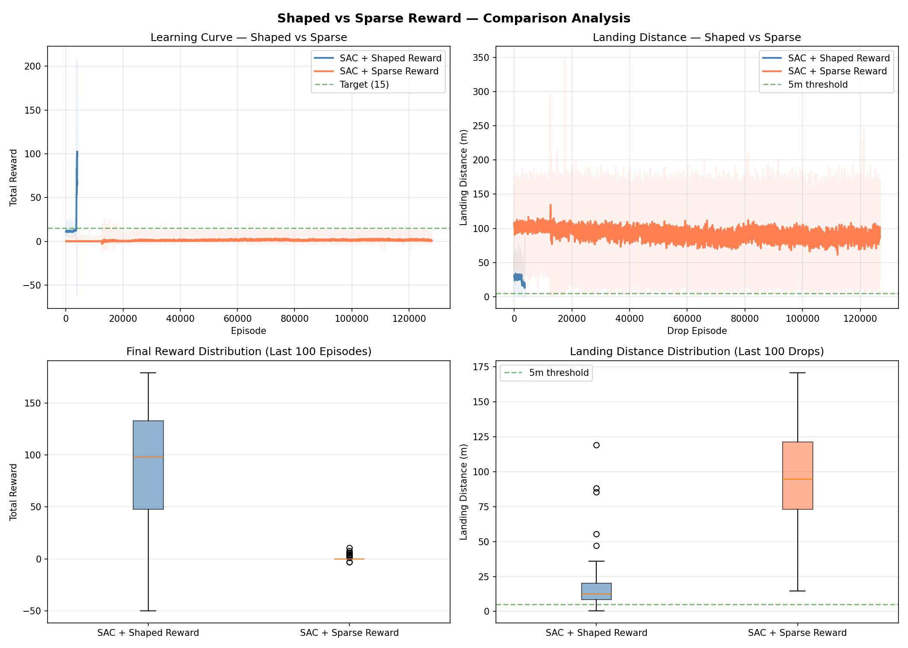

# Drone Drop RL: Shaped vs Sparse Reward 비교 분석

> **실험일**: 2026-03-07  
> **알고리즘**: SAC (Soft Actor-Critic)  
> **환경**: 커스텀 3D 드론 투하 시뮬레이터  

---

## 1. 실험 개요

본 실험은 **보상 함수 설계**가 강화학습 에이전트의 학습 효율과 최종 성능에 미치는 영향을 분석한다.
동일한 SAC 알고리즘과 3D 드론 환경에서 두 가지 보상 체계를 비교한다:

| 시나리오 | 설명 |
|----------|------|
| **SAC + Shaped Reward** | 4계층 계층적 보상 함수로 매 스텝 학습 신호 제공 |
| **SAC + Sparse Reward** | 투하 결과에만 보상 부여, 중간 과정 신호 없음 (대조군) |

---

## 2. 환경 설명

커스텀 3D 드론 투하 시뮬레이터로 Gymnasium 인터페이스를 구현한다.

| 파라미터 | 값 |
|----------|----|
| 관찰 공간 차원 | 14 |
| 액션 공간 차원 | 4 (lateral, forward, vertical, drop) |
| 월드 크기 | 80 × 80 m |
| 비행 고도 | 40 m (기본) / 최대 60 m |
| 시뮬레이션 주기 | 30 Hz (dt = 1/30 s) |
| 에피소드 최대 스텝 | 600 (20초) |
| 최대 풍속 | 5 m/s |
| 성공 기준 | 착지 거리 < 5 m |

**보상 해킹 방지 메커니즘**:
- Potential-based shaping (Ng et al., 1999) — 최적 정책 불변 수학적 보장
- 에너지 페널티 — 타겟 근처 진동(jittering) 방지
- 1회성 투하 — 반복 투하 시도 불가

---

## 3. 보상 함수 비교

### 3.1 Shaped Reward (4계층 계층적 보상)

```
Layer 1 — 안전      경계 위반 시 큰 음의 보상 + 에피소드 종료
                    최소 안전 고도 5m, 최대 속도 30 m/s
Layer 2 — 효율성    에너지 페널티 (매 스텝): -0.002 × ||action||
Layer 3 — 접근 유도 Potential-based shaping (스케일 10.0) + 정렬 보너스 (매 스텝, 투하 전)
Layer 4 — 투하 정밀도 거리 비례 보상(최대 15) + 정밀도 티어 보너스 (투하 시 1회)
                    · 1m 이내: +10  · 3m 이내: +5  · 5m 이내: +2
```

### 3.2 Sparse Reward (대조군)

```
중간 과정: 보상 없음 (0)
투하 시:   거리 비례 보상만 (최대 15, Shaped와 동일한 스케일)
안전 위반: Shaped와 동일한 페널티
```

---

## 4. 학습 결과

### 4.1 수치 통계

마지막 100 에피소드 기준 통계:

| 지표 | SAC + Shaped | SAC + Sparse |
|------|:------------:|:------------:|
| 총 에피소드 수 | 3,964 | 127,941 |
| 평균 보상 (마지막 100) | 86.41 | 0.92 |
| 보상 표준편차 | 55.62 | 2.06 |
| 최대 보상 | 179.10 | 10.57 |
| 평균 착지 거리 (m) | 17.12 | 93.54 |
| 거리 표준편차 (m) | 17.18 | 38.51 |
| 성공률 (< 5m) | 11.0% | 0.0% |

> **비고**: Shaped의 에피소드 수가 적은 이유는 보상 신호가 충분해 조기 수렴했기 때문이다.
> Sparse는 유의미한 보상 신호를 얻기 위해 훨씬 많은 시도가 필요하다.

### 4.2 비교 차트



차트 구성:
- **상단 좌**: 학습 곡선 (이동평균 50 에피소드) — 보상 변화 추이
- **상단 우**: 착지 거리 학습 곡선 — 정밀도 개선 추이
- **하단 좌**: 마지막 100 에피소드 보상 분포 (박스플롯)
- **하단 우**: 마지막 100 에피소드 착지 거리 분포 (박스플롯)

---

## 5. 결론

### 5.1 핵심 발견

1. **Shaped Reward의 압도적 우위**  
   Shaped는 3,964회 만에 평균 보상 **86.4**을 달성한 반면,
   Sparse는 127,941회에도 평균 보상 **0.92**에 그쳤다.

2. **착지 정밀도 격차**  
   Shaped 성공률(11.0%) vs Sparse 성공률(0.0%).
   Sparse는 무작위 탐색만으로는 5m 이내 착지가 사실상 불가능함을 보여준다.

3. **샘플 효율성**  
   Sparse가 Shaped보다 약 32배 많은 에피소드를 수행했음에도
   수렴하지 못했다. 드론 투하처럼 희귀한 성공 이벤트가 있는 환경에서 Sparse Reward는
   신뢰도 있는 학습 신호를 제공하기 어렵다.

### 5.2 시사점

- **보상 설계의 중요성**: 동일한 SAC 알고리즘이라도 보상 함수 설계에 따라 결과가 극단적으로 달라진다.
- **Potential-based Shaping의 효과**: 최적 정책 불변성을 수학적으로 보장하면서도 학습 신호를 풍부하게 제공한다.
- **계층적 보상의 실용성**: 안전 → 효율 → 접근 → 정밀도 순서로 우선순위를 부여하면
  에이전트가 단계적으로 복잡한 행동을 학습할 수 있다.

---

*생성: `python -m drone_drop_rl.compare`*
